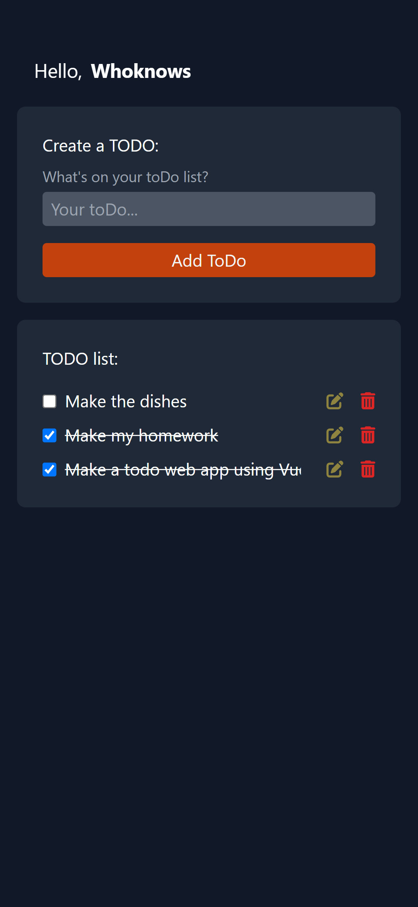

# Task List

This is a task list application built with Vue.js 3 and Vite using Tailwind. It allows users to easily create, mark as completed, edit and delete tasks. The application saves the data on the local storage, so the tasks will be saved even when the user closes the browser.

Mobile:


Desktop:


## Features
- Create new tasks
- Mark tasks as completed
- Edit existing tasks
- Delete tasks

## Deployment
The application is deployed on Netlify, you can access the application by visiting the following link: [Link to the deployed application](https://whoknows-todo-list-vue.netlify.app/)

## Development

To run the application locally:

1. Clone the repository

```git clone https://github.com/whoknowsi/todo-list-vue.git```

2. Install the dependencies

```npm install```

3. Start the development server

```npm run```

4. Open the application in your browser at localhost:5173

## License

This project is licensed under the [MIT License](LICENSE.md)
